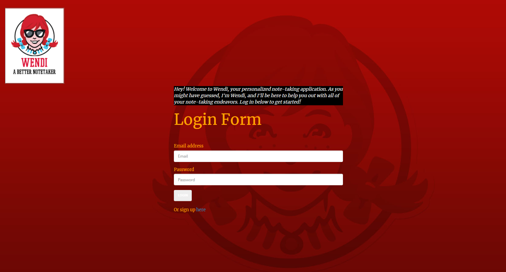

# WENDI!

## Description/Motivation
Are you attending an online course and looking for an effective way to create and store notes? While some may prefer the traditional paper-and-pencil method, we believe that a virtual note-taking application can provide students with an intuitive, systematic and efficient way to record lessons, file notes and archive data throughout the course of a semester or academic year. Plus: By opting for a virtual application, we guarantee that you will never break a sweat fretting over broken lead, notebooks with limited space or ink-smudged hands ever again, at least not while taking notes!

Wendi, your personalized note-taking application, allows you to do all the above in a secure, user-friendly location. Each account is username and password-protected, so only the creator of the notes has direct access to them. In terms of user-friendliness, we aimed to create a minimalistic, streamlined platform with dynamic, JavaScript-activated buttons. 

Our application utilizes SQL to store user data and other information (e.g., time stamps), which can be retrieved from the back-end database and displayed on the web page via user requests. Additionally, users’ log-in credentials will also be recorded and saved in a database created via SQL.

## Installation
To access our application, click on the following link (https://wendi-notes-app.herokuapp.com/). If you have successfully reached the web page, you will see the landing page below:

Note: This page will ask the user to enter their log-in credentials (i.e., the username and password they created with their account). Please note that a user will not be able to access additional web pages or utilize the applications various functions before an account has been created.

## Usage
Our application consists of four interfaces: a log-in page, a sign-up page, a page where the user can create new notes with titles and time stamps as well as a note archive via which the user can go back and look at saved notes. When a user without an account reaches the log-in page, they can click on the "Sign up here" button to be redirected to the sign-up page, where they will be able to create an account. Once an account has been created, the user can return to the log-in page and type their account credentials into the input fields to access the home page.

On the home page, the user can create a note, add a relevant title and any additional information and then create a saved copy, which is stored on the archives page.

## Tech Used
This web page was created using HTML, CSS, JavaScript, SQL, Handlebars, node, express, and a Sequelize ORM. Our team utilized Spectre.css – a public CSS library – to create a more aesthetically pleasing interface for the user. Moreover, we made use of Kanban on GitHub to create, delegate, and manage tasks for this project; tasks were divided into two groups: front-end and back-end. Finally, our application was deployed via Heroku.

During the initial stages of the project, we used a wire-framing tool to create a blueprint for the web page, which helped us visualize and establish a preliminary structural layout. An ossature was created for each individual page of our application. Below, please find images of our initial schematics, which were created on wireframe.cc. For purposes of consistency, we based the design for the sign-up page on the schematic for the user log-in page.

User Log-In

Note Creator

Note Archives

## Sources:
Wireframe: https://wireframe.cc/ 
Spectre.css: https://picturepan2.github.io/spectre/

## Additional Information
Please click on the following links to be redirected to the GitHub profiles of the programmers who collaborated this project:

Front-End Team:
- Caleb Dunahee: https://github.com/cdunahee36
- Peter O'Connor: https://github.com/ftrcafekundera

Back-End Team:
- Rafael Rosas: https://github.com/rafaelrosas19
- Joshua Vaslie: https://github.com/joshuavaslie2021

## License
                    GNU GENERAL PUBLIC LICENSE
                       Version 3, 29 June 2007

 Copyright (C) 2007 Free Software Foundation, Inc. <https://fsf.org/>
 Everyone is permitted to copy and distribute verbatim copies
 of this license document, but changing it is not allowed.

